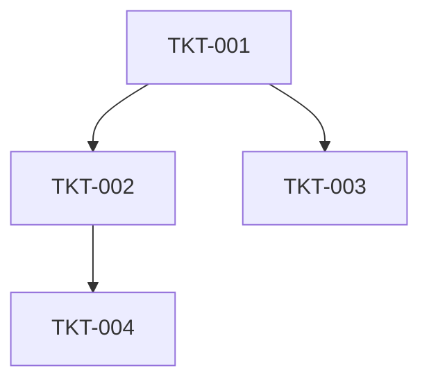

# Implementation Plan Template

**Layer:** Templates / Workflows / Implementation
**Owner:** Implementation Agent (`agents/core-pipeline/implementation_agent.md`)
**Source Workflow:** `06 - workflows/implementation.md`
**Version:** 1.0

## Purpose

Decompose the Architecture Object into an ordered, testable build sequence. The Implementation Plan converts architectural decisions into buildable units of work that can be assigned, sequenced, and tracked. Every work item has clear acceptance criteria, dependencies, and an owner. The Plan is consumed by the build agents and used to track progress.

## When to Use

- After Architecture Object is approved
- Before any code is written
- When re-planning after a major scope change
- When onboarding new contributors to the codebase

## Structure

### Header

| Field | Type | Required |
|-------|------|----------|
| plan_id | text (e.g. PLAN-001) | yes |
| project_id | text | yes |
| architecture_object_ref | path | yes |
| plan_version | text (semver) | yes |
| created_date | date | yes |
| last_updated | date | yes |
| status | enum (draft, approved, active, archived) | yes |
| target_completion | date | yes |

### Build Sequence

Define ordered phases that decompose the build into shippable increments.

For each phase:

| Field | Type | Required |
|-------|------|----------|
| phase_id | text (e.g. PHASE-1) | yes |
| phase_name | text | yes |
| goal | textarea (1-2 sentences) | yes |
| shippable_artifact | text (what becomes live after this phase) | yes |
| depends_on | list (phase_ids) | yes |
| estimated_duration | text | yes |
| risk_level | enum (low, medium, high) | yes |
| demo_criteria | textarea (what proves this phase is done) | yes |

### Work Items (Tickets)

For each work item:

| Field | Type | Required |
|-------|------|----------|
| ticket_id | text (e.g. TKT-001) | yes |
| title | text | yes |
| phase_id | text | yes |
| owner | text (human or agent) | yes |
| type | enum (feature, infrastructure, refactor, bug, chore) | yes |
| priority | enum (critical, high, medium, low) | yes |
| estimated_effort | text (e.g. 2 days, 1 sprint) | yes |
| status | enum (todo, in_progress, blocked, review, done) | yes |
| depends_on | list (ticket_ids) | yes |
| blocks | list (ticket_ids) | no |
| acceptance_criteria | list | yes |
| test_requirements | list (test scenarios) | yes |
| definition_of_done | list | yes |
| linked_prd_section | text | conditional |
| linked_architecture_section | text | conditional |
| parallel_safe | boolean | yes |

### Critical Path

Identify the longest dependency chain that determines minimum time to launch:

| Order | Ticket | Depends On | Duration |
|-------|--------|------------|----------|
| 1 | | | |
| 2 | | | |
| ... | | | |

### Parallelization Opportunities

Identify work items that can run in parallel without dependencies:

| Group | Tickets | Justification |
|-------|---------|---------------|
| A | | |
| B | | |

### Risk Register

For each identified risk:

| Field | Type | Required |
|-------|------|----------|
| risk_id | text | yes |
| description | textarea | yes |
| probability | enum (low, medium, high) | yes |
| impact | enum (low, medium, high) | yes |
| mitigation | textarea | yes |
| owner | text | yes |
| status | enum (open, mitigated, accepted, closed) | yes |

### Dependency Graph

Reference to the visual dependency graph (Mermaid diagram, image, or external link):

### Release Strategy

| Field | Type | Required |
|-------|------|----------|
| release_strategy | enum (big_bang, phased_rollout, feature_flag) | yes |
| rollout_phases | list | conditional |
| feature_flags_used | list (flag names, ticket_ids) | conditional |
| kill_switches | list | yes |
| rollback_procedure | textarea | yes |

### Resource Allocation

| Field | Type | Required |
|-------|------|----------|
| primary_builders | list (humans + agents) | yes |
| reviewers | list | yes |
| qa_owners | list | yes |
| on_call_rotation | list | yes |

### Status Reporting

| Field | Type | Required |
|-------|------|----------|
| status_update_frequency | text (e.g. daily, weekly) | yes |
| status_report_format | textarea | yes |
| blockers_escalation_path | textarea | yes |

## Validation Rules

- Every ticket must have `acceptance_criteria` and `definition_of_done`
- Critical path tickets must have `owner` assigned
- High-risk work items must have paired `mitigation` in risk register
- Parallelization groups must not have hidden dependencies
- Release strategy must include `kill_switches`

## Cross-References

- **Workflow:** `06 - workflows/implementation.md`
- **Architecture input:** `04 - templates/workflows/architecture/architecture-object.md`
- **Test specifications:** `04 - templates/workflows/implementation/test-plan-spec.md`
- **Component specs:** `04 - templates/workflows/implementation/component-spec.md`
- **PRD:** `reference/apparchitect-prd-suite/base-prds/07-implementation-prd.md`

---

*The Implementation Plan is the source of truth for what gets built, by whom, and in what order.*
